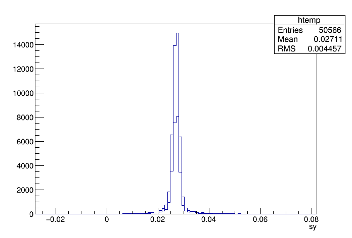
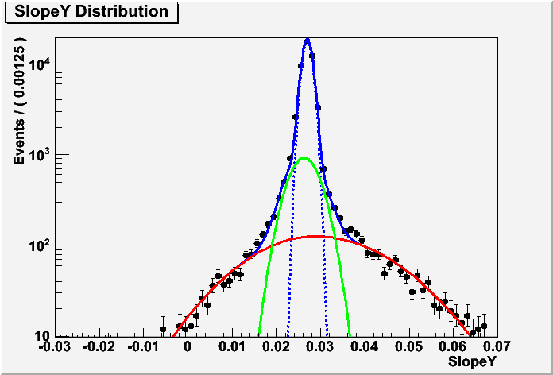
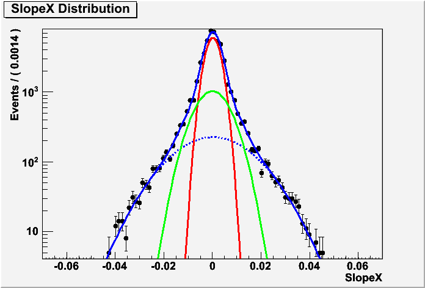
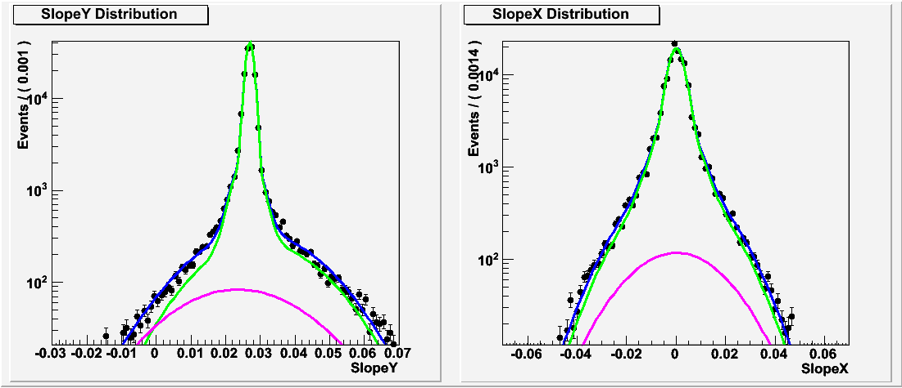
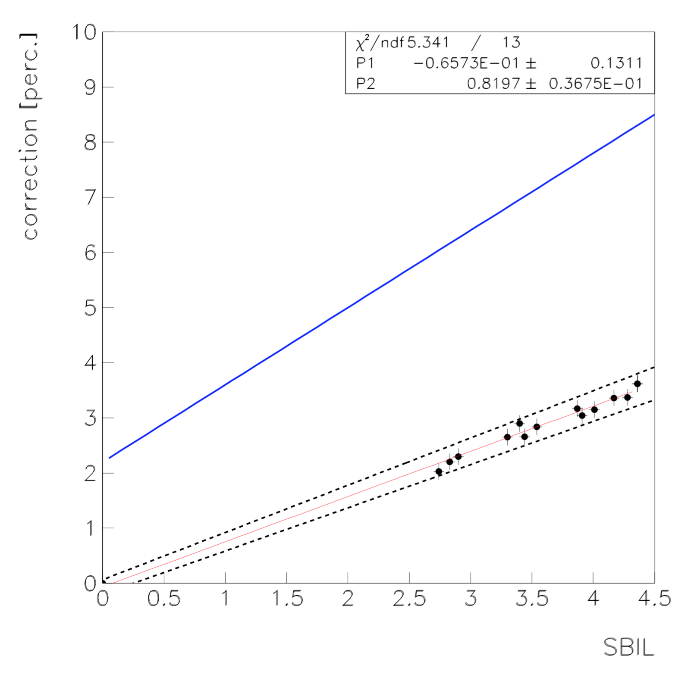

# VdMStudies
This directory contains results from the 2016 VdM track Analysis (Fill 4954) and also serves as a template for making similar studies for other fills.

##### Basics
1. `Slink_File` and `Gaincal_File` for a given fill
2. Generate Alignment_File using `./CalculateAlignment Slink_File Gaincal_File Alignment_IdealInstall.dat`
3. Change Trans_Alignment.dat generated from (2) to `Trans_Alignment_FillNo.dat`


## Track Parameters
For a given fill, one may be interested in knowing how track parameters change during scans or if there's some weird thing happening to a partiular channel/quadrant at partiuclar time, etc. To that end, we first generate the `TrackParams.root` file by invoking the following (Fill 4954):

`./TrackParams Slink_20160527.075047.dat GainCalFits_20160526.125155.dat Trans_Alignment4954.dat`

Default track parameters are Beamspots, Slopes, Residuals, nBX, Channels, TrackID. Modify `bin/TrackParams.cc` if you are interested in other variables (intercepts to Z=0 plane,X-Y at local telescope coordinates per ROC,etc). Fun!

### VdM Fill 4954

For VdM scans, we may be interested in knowing tracks as a function of separation between Beam1 and Beam2. So, we will need scanpoint information--`scanY1.txt` (pointNum, timeFrom, timeTo, Separation). For further analysis of track parameters, we generate ttree per separation point by invoking the following:

```
root -l
.L VdMClass.C+
VdMClass m
m.Loop("scanY1")
```

Boom! You now have t4954scanY1.root file. TTree now has "pt" branch that assigns the separation between beams for each track.

#### Usage
Let's say you would like to look at SlopeY at VdM Fill when beams were not separated i.e. 0 mm separation (pt==13) vs when they were separated by 0.344454 mm (pt ==20). 

```
root -l  t4954scanY1.root
perSCP->Draw("sy","pt==13")
perSCP->Draw("sy","pt==20","same")
```


## Likelyhood Fits
SBIL for VdM is close to 0. As we increase SBIL, what "extra" things do we see? Does luminosity scale linearly? What about second-order terms?...

Requirements: 
```
1. RooFit package
2. Track parameters at VdM and at different SBIL
```

#### Generate text file for VdM 0 mm separation

```
root -l t4954scanpointY1.root
perSCP->SetScanField(0)
perSCP->Scan("sx:sy","pt==13"); >> xyVdM.txt
```

remove the *'s and column names from the text file. We would like to eventually use xyVdM.txt to get parameters for the likelyhood fit.


#### Fit a model
Using VdMSlopeYModel.C, VdMSlopeXModel.C, and xyVdM.txt, get the VdM parameters.
```
SlopeY Model::
Gaussian_core(m,sigma) + f_1 * Gaussian_outlier(m,sigma) + f_2 * BiGaussian(m,sigmaL, sigmaR)
```


```
SlopeX Model::
Gaussian_core(m,sigma) + f_1*Gaussian_outlier(m,sigma) + f_2* Gaussian(m,sigma)
```



##### Extra
1. Validate fit with Toys letting fractions freeze/float
2. Cross check: fit VdM data with full model ==>fits f = 0
3. Systematic uncertainty   
    a. Shape variation:  Try two Gaussians with well separated mean (and sigma) instead  of single Gaussian 
    when floated converge back to single Gaussian (BiGaussian)

    b. Single Gaussian %  BiGaussian interchange
    
    c. Use parameters from only the colliding bunches at VdM.
4. Fix widths to values of measurements at comparable luminosity
5. Let  VdM core Gaussian parameters float


## Other fills
For other fills, we are interested in seeing how track parameters vary as a function of SBIL. The goal is to assign SBIL value to tracks--trackClass.C and trackClass.h are for that purpose. 

We would need few things---TrackParams.root, DipFillNo.txt, fill date, the number of colliding bunches.

1. TrackParamsFillNo.root:: ./TrackParams Slink_File Gaincal_File TransAlignment_File
2. dipFillNo.txt:: Go to the page `ConditionBrowser/CMS_BEAM_COND/CMS_BRIL_LUMINOSITY/PLTZERO_INSTLUMI/` and make a plot. Click on text and save the resulting text file, remove the header lines and save as `dipFillNo.txt`.

 After getting TrackParams.root, you will need to change the pointer to the root file at ` TFile *f =... ` @ trackClass.h. You will also need to know the Epoch time from the start day of the fill that you are inspecting. For example, Fill 5013 is from 2016-06-11. The 0th hour, 0th minute, 0th sec Epoch timestamp turns out to be 465603200 for that day. Change the timeOffset on trackClass.C to that value. We also need the number of colliding bunches--2048 for fill 5013.

Example usage

```
root -l
.L trackClass.C+
trackClass m
m.Loop("dip5013.txt",2028) 
```
This gives trackSBIL.txt file which tells us what the SBIL value was for each TrackID. Now, you're ready to make some likelyhood fits!

## Combined Fits
Having known the parameters for SlopeX and SlopeY, we use these parameters in VdMfreezeSxSy.C and float extra PDF (Bifurcated Gaussian for SlopeY and regular gaussian for SlopeX). Frac3 is a common floating parameter that we are interested in knowing. 

For a given fill, SlopeX and SlopeY data at different SBIL can be obtained by the following procedure:
```
root -l TrackParms.root
Tracks->SetScanField(0)
Tracks->Scan("SlopeX:SlopeY","TrackID==idnum"); >> xyFillNo_idnum.txt
```

For each `TrackID==idnum`, we have SBIL value from trackSBIL.txt. We now make a fit to the combined model to get the fratcion of "extra stuff" as a function of SBIL via VdMfreezeSxSy.C (xyFillNo_idnum.txt as input). For Fill 5013, at SBIL ~3.4, we get the following result where magenta is the frac3 on top of VdM model.




Rinse and repeat for different SBIL from different fills to get the fraction. We have SBIL corresponding to idnum, and frac3 for each SBIL. Result:

